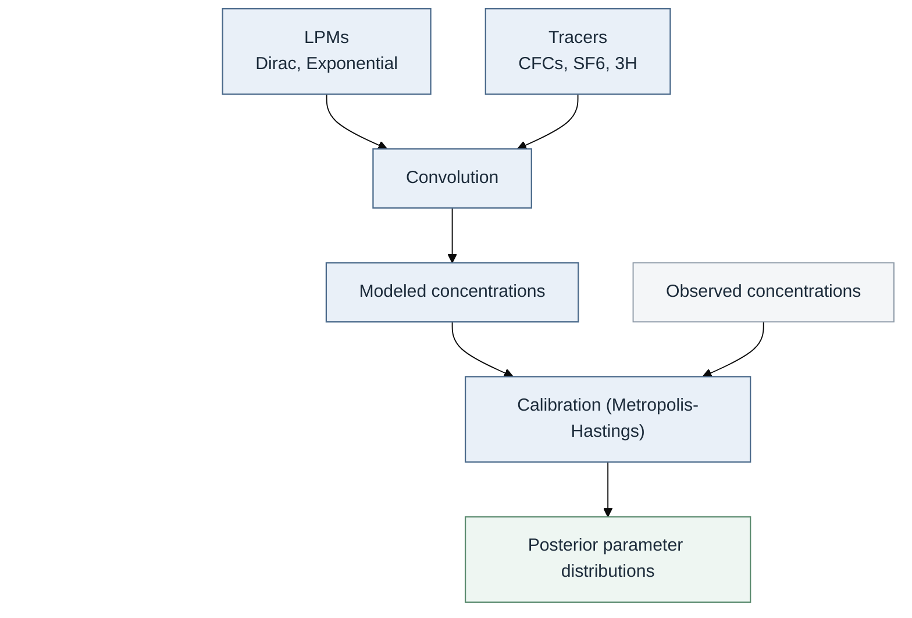

# Figure 1 — PyAge scientific workflow (overview)

```mermaid
flowchart TB
  %% Increase font size for publication
  %% Mermaid theme variables are supported by mermaid-cli
  %% (12 is default-ish; we push to 16 for readability)
  %%{init: {"theme": "base", "themeVariables": {"fontSize": "16px"}}}%%
  %% Node styles
  classDef main fill:#e9f0f8,stroke:#4b6a8b,stroke-width:1.2,color:#1c2b3a;
  classDef side fill:#f4f6f8,stroke:#8a97a5,stroke-width:1,color:#1c2b3a;
  classDef output fill:#eef6f2,stroke:#5b8b6f,stroke-width:1.2,color:#1c2b3a;

  %% Core classes
  TOP(( )):::spacer
  TOP2(( )):::spacer
  GAP(( )):::spacer
  LPM["LPMs<br/>Dirac, Exponential"]:::main
  TRACER["Tracers<br/>CFCs, SF6, 3H"]:::main
  CONV["Convolution"]:::main
  MODEL["Modeled concentrations"]:::main
  CAL["Calibration (Metropolis-Hastings)"]:::main

  %% External data / outputs
  OBS["Observed concentrations"]:::side
  OUT1["Posterior parameter distributions"]:::output
  %% (removed) Model diagnostics box

  %% Flow
  LPM --> CONV
  TRACER --> CONV
  CONV --> MODEL
  MODEL --> CAL
  OBS --> CAL
  CAL --> OUT1

  %% Hide example node boxes (label-only)
  classDef spacer fill:none,stroke:none,color:transparent;
  style TOP fill:none,stroke:none
  style TOP2 fill:none,stroke:none
  style GAP fill:none,stroke:none,color:transparent
  %% (no global linkStyle overrides)
```
