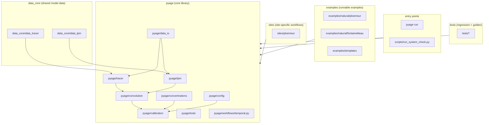

# PyAge architecture overview

```mermaid
flowchart TB
  subgraph Core["pyage (core library)"]
    LPM[pyage/lpm]
    TRACER[pyage/tracer]
    CONV[pyage/convolution]
    CAL[pyage/calibration]
    CONC[pyage/concentrations]
    CFG[pyage/config]
    IO[pyage/data_io]
    TOOLS[pyage/tools]
    TEMP[pyage/workflows/temporal.py]
  end

  subgraph Data["data_core (shared model data)"]
    LPMDATA[data_core/data_lpm]
    TRDATA[data_core/data_tracer]
  end

  subgraph Sites["sites (site-specific workflows)"]
    PLOEMEUR[sites/ploemeur]
  end

  subgraph Examples["examples (runnable examples)"]
    EXPL[examples/natural/ploemeur]
    EXFT[examples/natural/fontainebleau]
    EXTMP[examples/templates]
  end

  subgraph Scripts["entry points"]
    LAUNCH[pyage run]
    CHECK[scripts/run_system_check.py]
  end

  subgraph Tests["tests (regression + golden)"]
    TESTS[tests/*]
  end

  LPMDATA --> LPM
  TRDATA --> TRACER
  TRACER --> CONV
  LPM --> CONV
  CONV --> CAL
  CONC --> CAL
  CFG --> CAL
  IO --> LPM
  IO --> TRACER

  Sites --> Core
  Examples --> Core
  Scripts --> Core
  Tests --> Core
```
