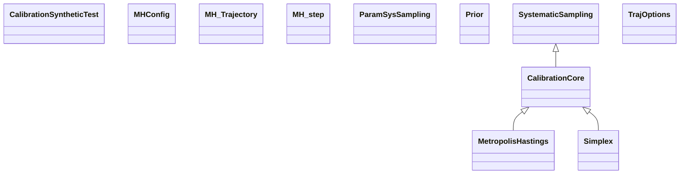

# UML classes for pyage/calibration

```mermaid
classDiagram
class CalibrationCore
class CalibrationSyntheticTest
class MHConfig
class MH_Trajectory
class MH_step
class MetropolisHastings
class ParamSysSampling
class Prior
class Simplex
class SystematicSampling
class TrajOptions
SystematicSampling <|-- CalibrationCore
CalibrationCore <|-- MetropolisHastings
CalibrationCore <|-- Simplex
```
