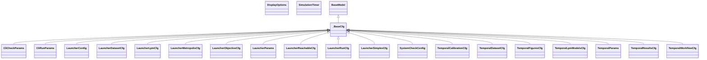

# UML classes for pyage/config

```mermaid
classDiagram
class CliCheckParams
class CliRunParams
class LauncherConfig
class LauncherDatasetCfg
class LauncherLpmCfg
class LauncherMetropolisCfg
class LauncherObjectiveCfg
class LauncherParams
class LauncherReachableCfg
class LauncherRunCfg
class LauncherSimplexCfg
class SystemCheckConfig
class TemporalCalibrationCfg
class TemporalDatasetCfg
class TemporalFiguresCfg
class TemporalLpmModelsCfg
class TemporalParams
class TemporalResultsCfg
class TemporalWorkflowCfg
class _BaseCfg
class DisplayOptions
class SimulationTimer
_BaseCfg <|-- CliCheckParams
_BaseCfg <|-- CliRunParams
_BaseCfg <|-- LauncherConfig
_BaseCfg <|-- LauncherDatasetCfg
_BaseCfg <|-- LauncherLpmCfg
_BaseCfg <|-- LauncherMetropolisCfg
_BaseCfg <|-- LauncherObjectiveCfg
_BaseCfg <|-- LauncherParams
_BaseCfg <|-- LauncherReachableCfg
_BaseCfg <|-- LauncherRunCfg
_BaseCfg <|-- LauncherSimplexCfg
_BaseCfg <|-- SystemCheckConfig
_BaseCfg <|-- TemporalCalibrationCfg
_BaseCfg <|-- TemporalDatasetCfg
_BaseCfg <|-- TemporalFiguresCfg
_BaseCfg <|-- TemporalLpmModelsCfg
_BaseCfg <|-- TemporalParams
_BaseCfg <|-- TemporalResultsCfg
_BaseCfg <|-- TemporalWorkflowCfg
BaseModel <|-- _BaseCfg
```
