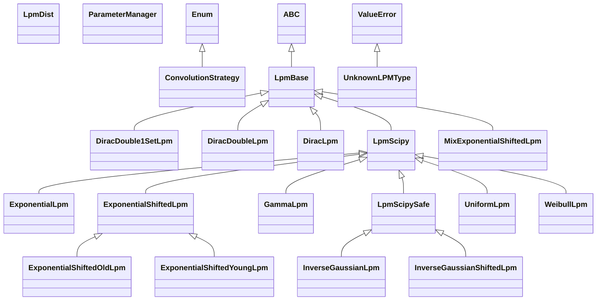

# UML classes for pyage/lpm

```mermaid
classDiagram
class ConvolutionStrategy
class DiracDouble1SetLpm
class DiracDoubleLpm
class DiracLpm
class ExponentialLpm
class ExponentialShiftedLpm
class ExponentialShiftedOldLpm
class ExponentialShiftedYoungLpm
class GammaLpm
class InverseGaussianLpm
class InverseGaussianShiftedLpm
class LpmBase
class LpmDist
class LpmScipy
class LpmScipySafe
class MixExponentialShiftedLpm
class ParameterManager
class UniformLpm
class UnknownLPMType
class WeibullLpm
Enum <|-- ConvolutionStrategy
LpmBase <|-- DiracDouble1SetLpm
LpmBase <|-- DiracDoubleLpm
LpmBase <|-- DiracLpm
LpmScipy <|-- ExponentialLpm
LpmScipy <|-- ExponentialShiftedLpm
ExponentialShiftedLpm <|-- ExponentialShiftedOldLpm
ExponentialShiftedLpm <|-- ExponentialShiftedYoungLpm
LpmScipy <|-- GammaLpm
LpmScipySafe <|-- InverseGaussianLpm
LpmScipySafe <|-- InverseGaussianShiftedLpm
ABC <|-- LpmBase
LpmBase <|-- LpmScipy
LpmScipy <|-- LpmScipySafe
LpmBase <|-- MixExponentialShiftedLpm
LpmScipy <|-- UniformLpm
ValueError <|-- UnknownLPMType
LpmScipy <|-- WeibullLpm
```
