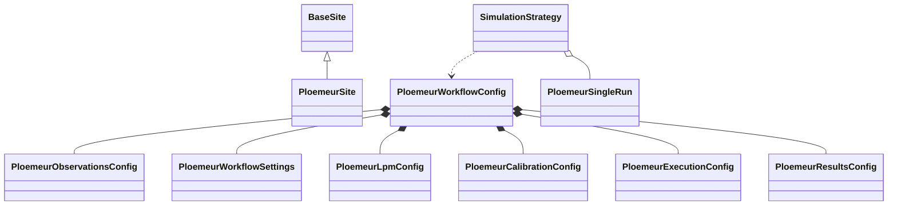

# UML classes for `sites/ploemeur`

```mermaid
classDiagram
class PloemeurSite
class PloemeurWorkflowConfig
class PloemeurObservationsConfig
class PloemeurWorkflowSettings
class PloemeurLpmConfig
class PloemeurCalibrationConfig
class PloemeurExecutionConfig
class PloemeurResultsConfig
class SimulationStrategy
class PloemeurSingleRun

BaseSite <|-- PloemeurSite
PloemeurWorkflowConfig *-- PloemeurObservationsConfig
PloemeurWorkflowConfig *-- PloemeurWorkflowSettings
PloemeurWorkflowConfig *-- PloemeurLpmConfig
PloemeurWorkflowConfig *-- PloemeurCalibrationConfig
PloemeurWorkflowConfig *-- PloemeurExecutionConfig
PloemeurWorkflowConfig *-- PloemeurResultsConfig
SimulationStrategy ..> PloemeurWorkflowConfig
SimulationStrategy o-- PloemeurSingleRun
```
