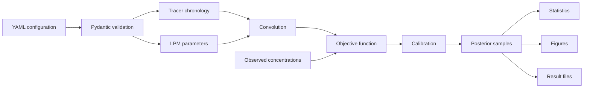

# PyAge scientific execution flow

The same core flow is used by single-date and temporal workflows. Site code
prepares configuration and observations but does not replace the scientific
components shown here.
