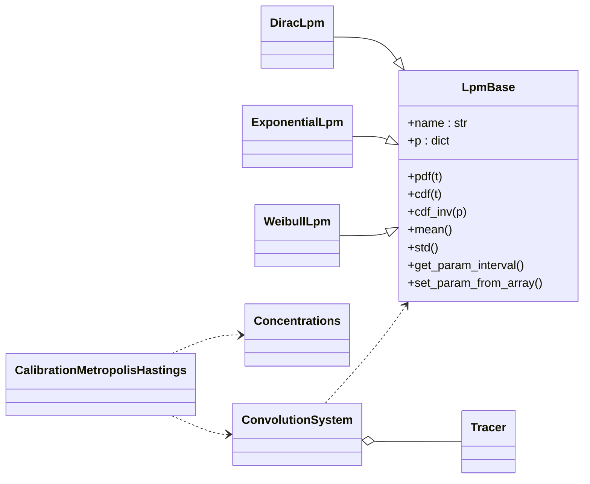

# PyAge scientific core (UML classes)

```mermaid
classDiagram
direction LR
class LpmBase {
  +name : str
  +p : dict
  +pdf(t)
  +cdf(t)
  +cdf_inv(p)
  +mean()
  +std()
  +get_param_interval()
  +set_param_from_array()
}

class DiracLpm
class ExponentialLpm
class WeibullLpm

class Tracer

class ConvolutionSystem

class Concentrations
class CalibrationMetropolisHastings

DiracLpm --|> LpmBase
ExponentialLpm --|> LpmBase
WeibullLpm --|> LpmBase

ConvolutionSystem o-- Tracer
ConvolutionSystem ..> LpmBase

CalibrationMetropolisHastings ..> ConvolutionSystem
CalibrationMetropolisHastings ..> Concentrations
```
